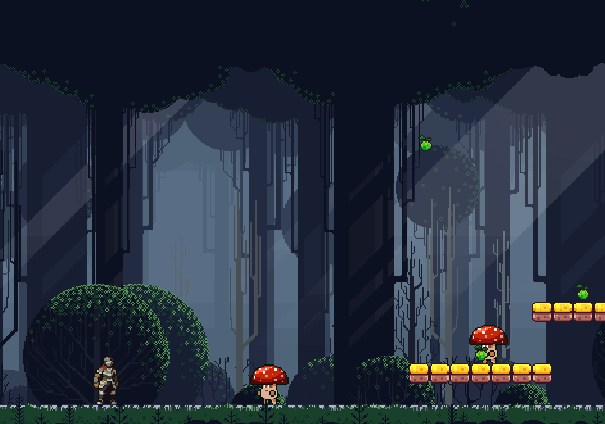

# Anton Nikulin

 

# Réalisations  

## Semaine 1  
- J'ai réussi à corriger le code de base utilisé pour créer le jeu vidéo avec Phaser.  
- Cette correction m'a permis de continuer à travailler sur tous les aspects majeurs du jeu.  

## Semaine 2  
- J'ai créé un prototype du jeu, comprenant :  
  - Le joueur avec plusieurs de ses animations.  
  - Un ennemi avec certaines de ses animations.
  - Un arrière-plan en couches créant un effet de mouvement.  

### Aperçu de la Semaine 2  
<table>
  <tr>
    <td></td>
  </tr>
</table>

### Semaine 3  
- J'ai réalisé d'énormes avancées dans le code du jeu.  
- Ajout des deux principaux ennemis.  
- Implémentation du système de combat.  
- Intégration de nombreux assets visuels créés pour le jeu.  

Ces progrès permettent maintenant de donner plus de vie et d'interactivité au jeu, en rendant le gameplay plus dynamique et fluide.  

### Vidéo de la Semaine 3  
[Voir la vidéo](vid1.mov)
