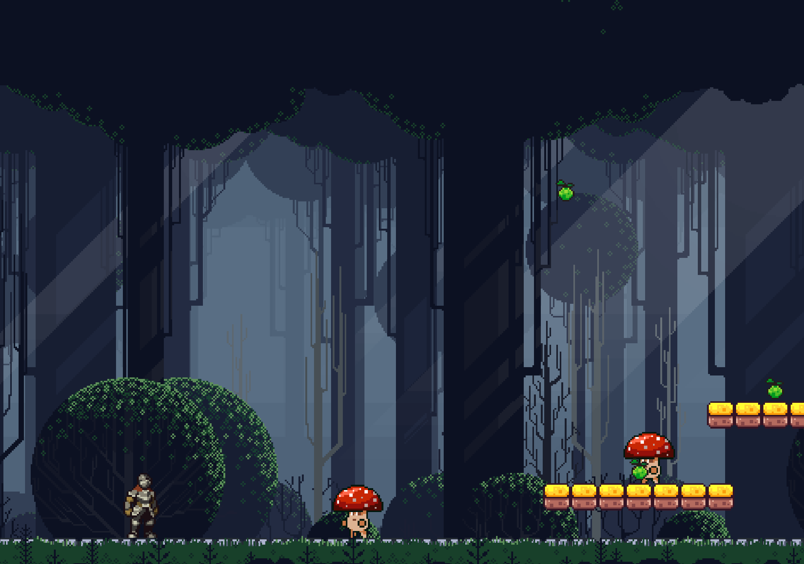
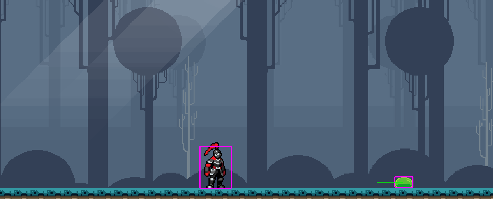
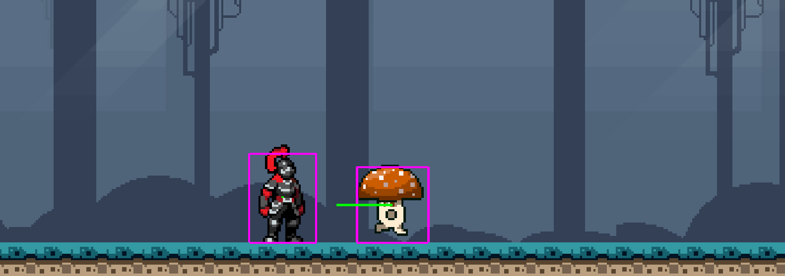
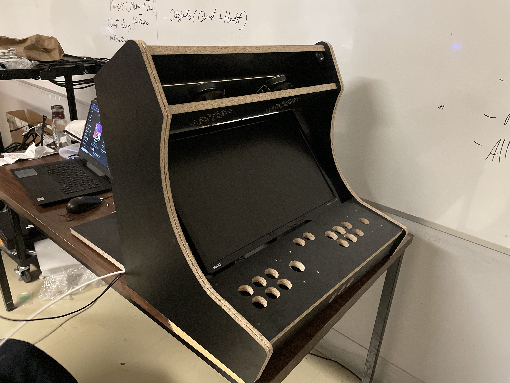
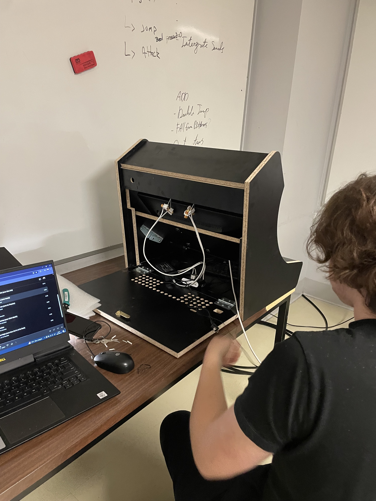
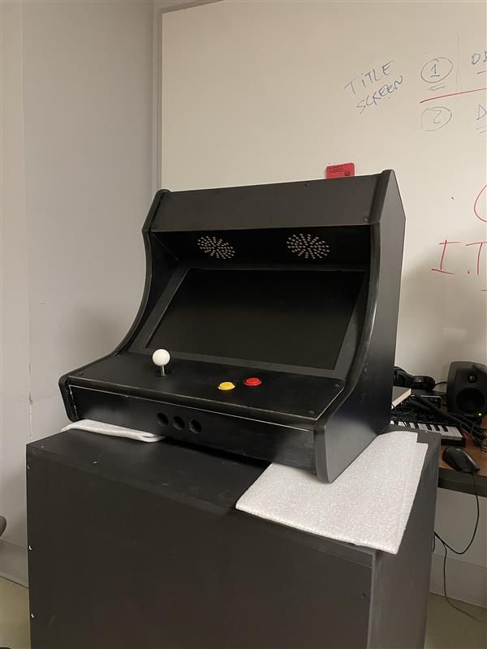

# Anton Nikulin

 

# Réalisations  

## Semaine 1  
- J'ai réussi à corriger le code de base utilisé pour créer le jeu vidéo avec Phaser.  
- Cette correction m'a permis de continuer à travailler sur tous les aspects majeurs du jeu.  

## Semaine 2  
- J'ai créé un prototype du jeu, comprenant :  
  - Le joueur avec plusieurs de ses animations.  
  - Un ennemi avec certaines de ses animations.
  - Un arrière-plan en couches créant un effet de mouvement.
 
### Aperçu de la Semaine 2  
* 

### Semaine 3  
- J'ai réalisé d'énormes avancées dans le code du jeu.  
- Ajout des deux principaux ennemis.  
- Implémentation du système de combat.  
- Intégration de nombreux assets visuels créés pour le jeu.  

Ces progrès permettent maintenant de donner plus de vie et d'interactivité au jeu, en rendant le gameplay plus dynamique et fluide.  

#### Aperçus de la Semaine 3  
* 
* 

### Vidéo de la Semaine 3  
[Voir la vidéo](vid1.mov)

### Semaine 4  
- J'ai ajouté la majorité des effets sonores du jeu.  
- Toute la semaine a été consacrée à l'implémentation et à la correction de bugs liés aux attaques des ennemis et du joueur.  
- Ajustement et débogage des hitbox pour garantir une meilleure précision lors des combats.  

Grâce à ces améliorations, les mécaniques de combat sont désormais plus fluides et réactives, rendant l'expérience de jeu plus immersive.  

### Effets sonores ajoutés :  
- **Marche** 🏃‍♂️ (bruit de pas)  
- **Saut** 🦘 (effet sonore pour le saut)  
- **Attaque** ⚔️ (son d'impact lors d'une attaque)  
- **Dégâts subis** 💥 (bruit lorsque le joueur est touché)  
- **Atterrissage** 👣 (son d'atterrissage après un saut)  
- **Ramassage d'objets** 🎵  
  - Santé ❤️ (bruit spécifique pour la récupération de vie)  
  - Objet de quête 📜 (effet sonore spécial pour les objets importants)  

### Semaine 5  
- J'ai travaillé sur la correction de plusieurs bugs majeurs liés aux hitbox du jeu.  
- J'ai implémenté le code de base pour assurer des transitions fluides entre les différentes scènes.  

### Semaine 6  
- J'ai réussi à implémenter l'animation de mort du joueur avec l'aide d'un collègue.  
- J'ai commencé à ajouter du code CSS pour améliorer le style du jeu.  
- J'ai également corrigé plusieurs bugs dans le code existant.  
- Début du travail d'assemblage de la structure en bois de la borne d'arcade.  

#### Aperçus de la Semaine 6  
  
  
  

