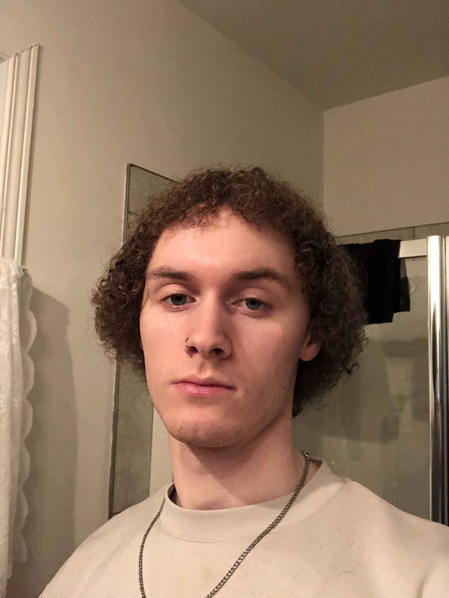
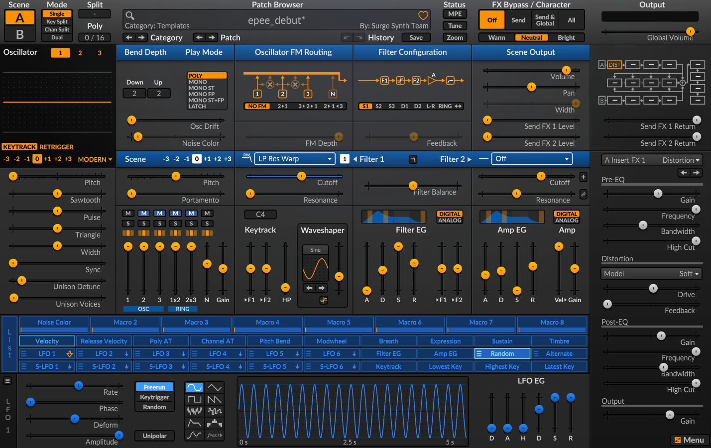

# Dominic Yale

 

 ## Réalisations

 <!-- Une image par semaine de la réalisation dont tu es le plus fier avec une légende -->
### Semaine 1
- Nous avons pu créer notre équipe et trouver notre concept.

### Semaine 2
- J'ai pu commencer a travailler dans un nouveau logiciel qui pourra me faciliter la tâche afin de créer des sons.
- J'ai pu commencer a créer un début de mélodie pour la musique du menu principal.

### Semaine 3
- Nous avons trouvé un nouveau concept pour le jeu, ce qui nous emmène dans une meilleur direction que le premier concept.
- J'ai réalisé les sons d'épée et de saut.

### Semaine 4
- J'ai réussi à terminer la plupart des effets sonores de base.
- J'ai réaliser la carte faite pour la maquette.
- Moi et mon équipe avons réussi a connecter les boutons d'arcade et le joystick au jeu afin de contrôler le personnage.
- Nous avons pu fabriquer une manette pour la maquette.

### Semaine 5
- Pour la semaine 5, j'ai commencer à réaliser les variantes des effets sonores.
- J'ai refait certains sons dont je n'étais pas convaincu de leur efficacité quant-à l'univers dans lequel le jeu se déroulera.
- Grâce à la visite des étudiants, nous avons pu modifier certaine choses qui allaient faire en sorte que les joueurs puisse profiter de l'expérience au maximum. 

### Semaine 6
- J'ai commencer à aider Anton avec la programmation du jeu.
- J'ai ajouté de l'interaction entre le sorcier et le chevalier avec un dialogue.
- J'ai continué à travailler sur les variantes des effets sonores.
- J'ai réalisé la bande sonore du menu principal.

### Semaine 7
- J'ai ajouté tous les effets sonores aux jeu en les faisant jouer aléatoirement à chaque interaction.
- J'ai réglé beaucoup de bug en lien avec les sons (Quand est-ce qu'ils doivent jouer et quand est-ce qu'ils doivent s'arrêter)
- J'ai intégré les interfaces quand on gagne le jeu et quand on perd le jeu.
- J'ai fait la bande sonore quand on gagne le jeu.

### Semaine 8

* 
