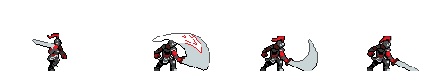

# William Beauvais

 ## Réalisations

 <!-- Une image par semaine de la réalisation dont tu es le plus fier avec une légende -->
### Semaine 1
- Trouver le style visuel que je veux utiliser et l'idée de départ du jeu
### Semaine 2
- J'ai fais la première image du personnage principal
* 
- J'ai fais un plan de la map (J'ai appris le logiciel Tiled)
* 
### Semaine 3
- Reconceptualisation du jeu qui nous permet maintenant d'avoir un projet qui tient la route
- Toutes les animations du personnage principal sont faites
* 

### Semaine 4
### Semaine 5
### Semaine 6
### Semaine 7
### Semaine 8
