# William Beauvais
* 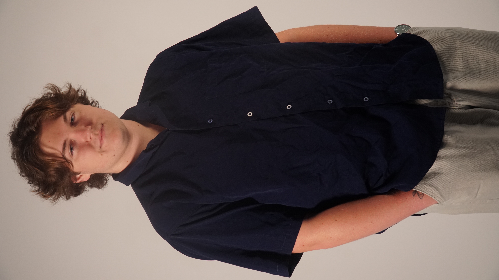

 ## Réalisations
### Semaine 1
- Trouver le style visuel que je veux utiliser et l'idée de départ du jeu
### Semaine 2
- J'ai fais la première image du personnage principal
* 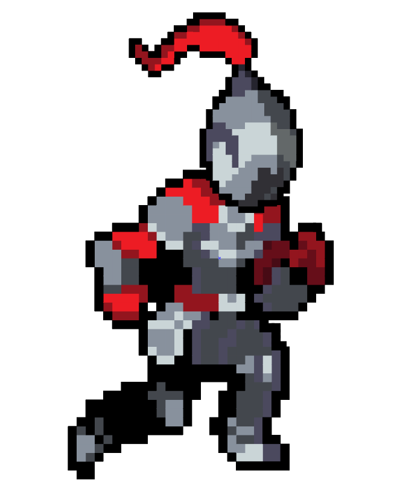
- J'ai fais un plan de la map (J'ai appris le logiciel Tiled)
* 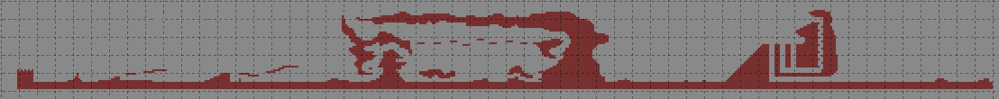
### Semaine 3
- Reconceptualisation du jeu qui nous permet maintenant d'avoir un projet qui tient la route
- Toutes les animations du personnage principal sont faites
* 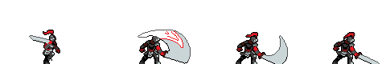
- Création du logo Arcadia
* 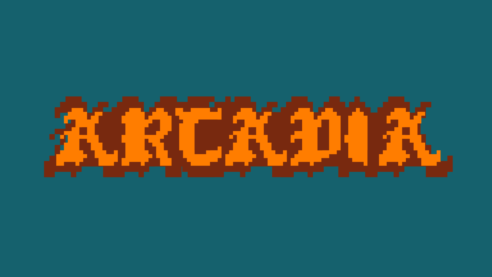

### Semaine 4
- Animation du champignon
* 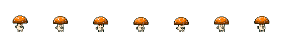
- Design du HUD
* 
* 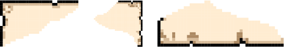
- Animation de Lavar
* 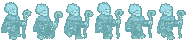
- Design du rubis
* 
- Design du tileset de base
* 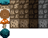
- Design de l'arrière plan
* 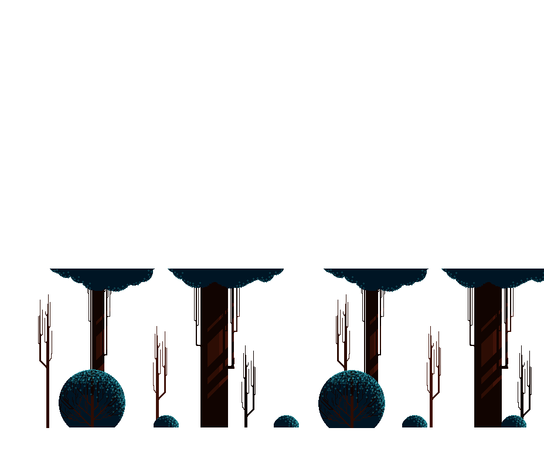
### Semaine 5
- Avancement des tileset
- Design et animation de l'escargot
* 
### Semaine 6
- Finalisation des 3 Tilesets (Décoration, Sol, Platformes)
* 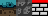
* 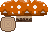
* 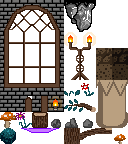
- Design de la boite de dialogue
* 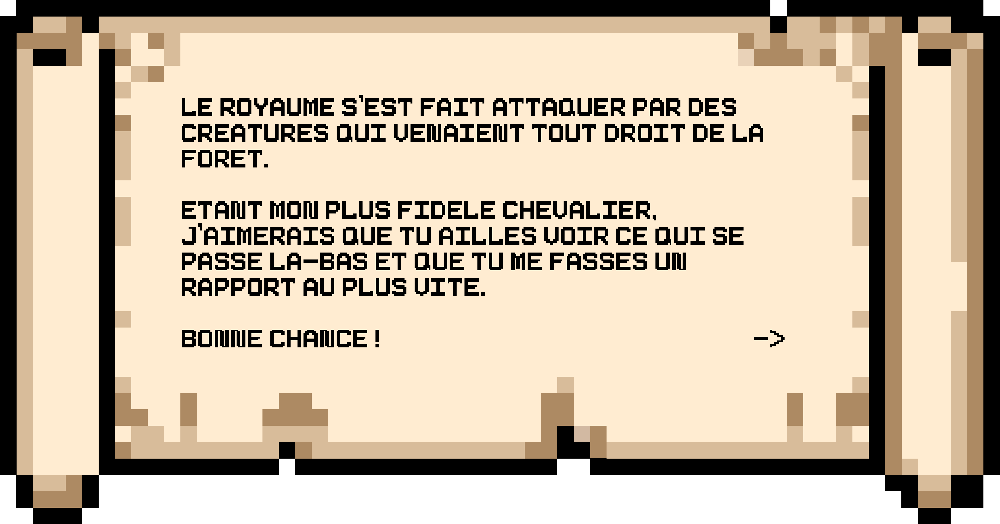
- Faire toute la map sur Tiled
* 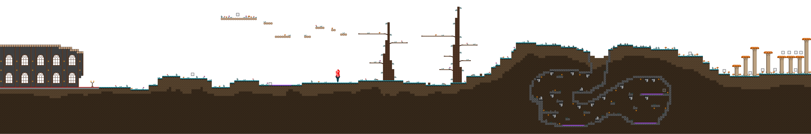
### Semaine 7
### Semaine 8
