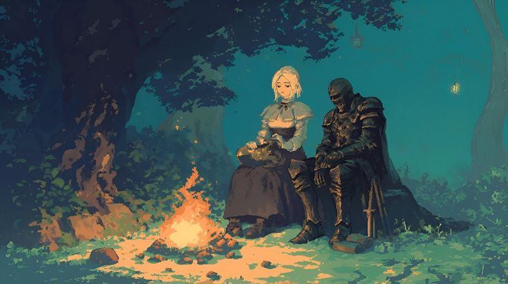
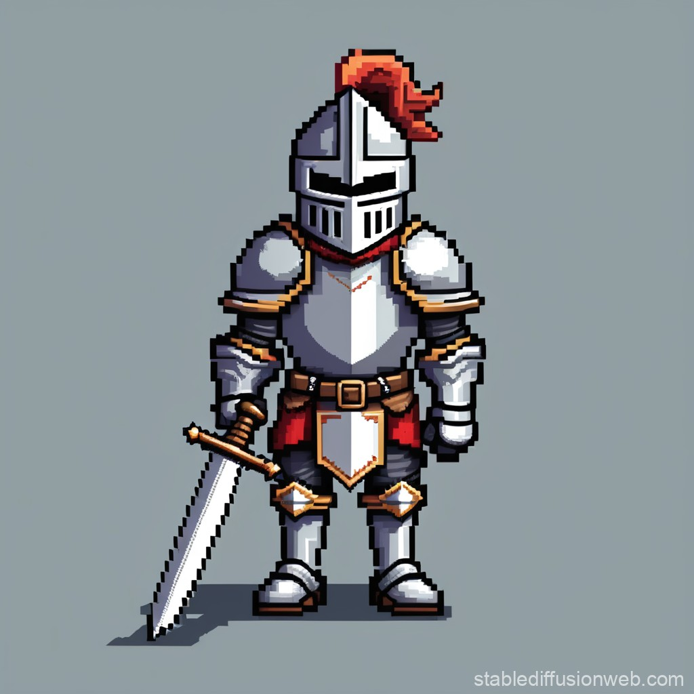
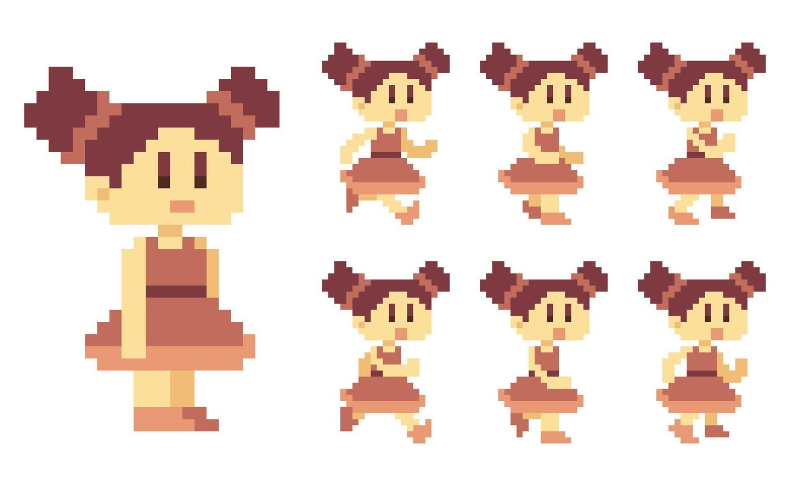
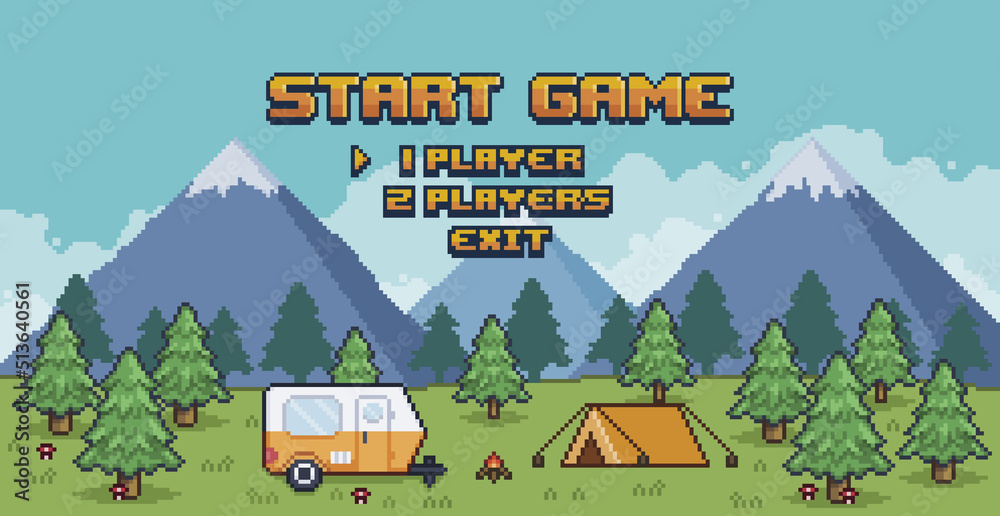
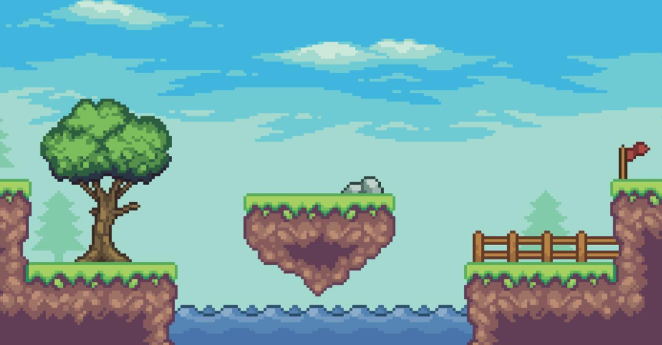
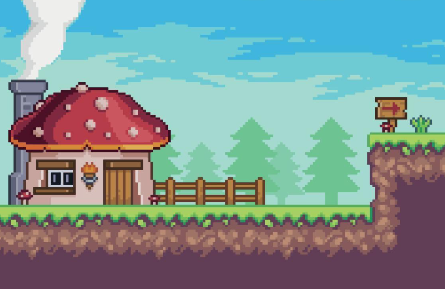
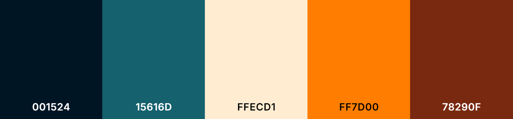

# Ambiance

## Inspirations visuelles

* 
* 
* 
* 
* 
* 
* 

## Inspirations multimédias

### thrames sonores

### effets sonores

## Références

[Ambiance](https://tim-montmorency.com/582523-gestion/#/contenus/2_scenarisation/30_ambiances/)
