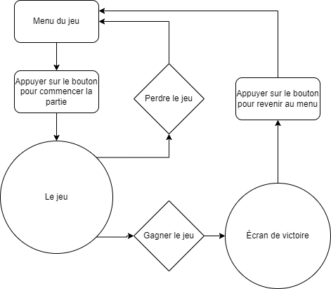

# Scénario

## Scénarisation: 
1- Objectif : [personnage] -­> [3 parchemins] -> [artefact] -> [conclusion] -> [loop]  
2- Défis : - champignon (attaque de mêlée)  
           - slime (moisisure)  
           - grenouille (dégats à distance/bouge pas)  
           - map

