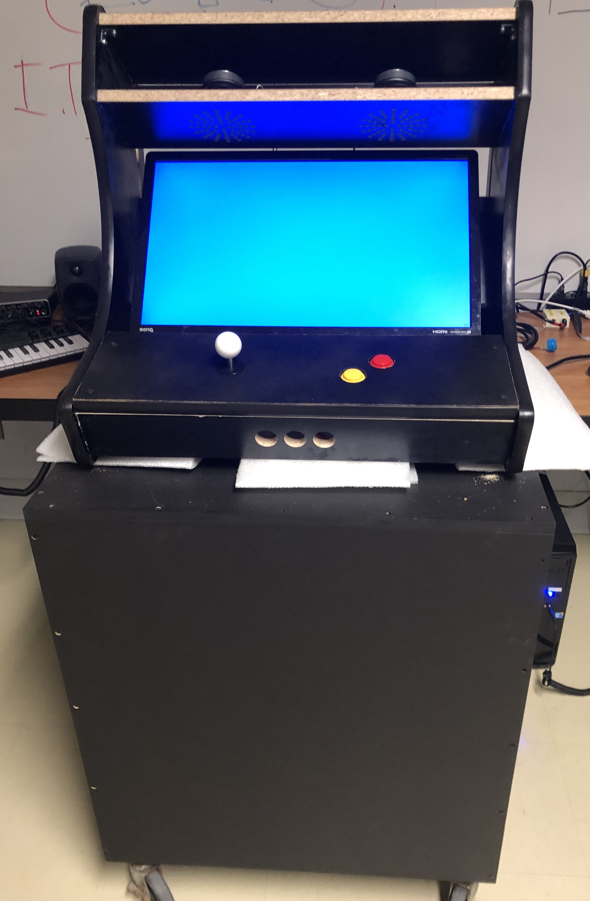
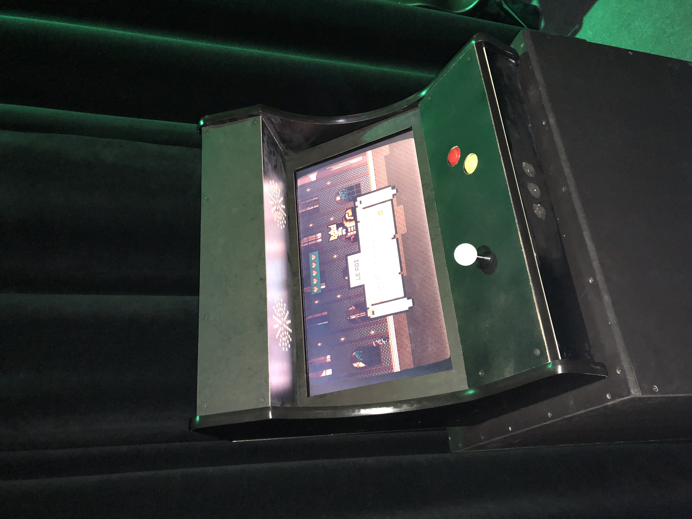

# Diffusion

Documentation du projet finalisé 

* 
* 
* 
* 

## 🎥 Tutoriel Vidéo
<iframe width="560" height="315" src="https://www.youtube.com/embed/T_AHrgQZ-zI" frameborder="0" allow="accelerometer; autoplay; encrypted-media; gyroscope; picture-in-picture" allowfullscreen></iframe>

* Documentation vidéo de l'installation en action

* Manuel d'instruction pour opération

# Assemblage Complet à Partir de Zéro

## 🛠️ **Partie 1 : Achat des Pièces Nécessaires**
1. **Acheter les pièces :**  
   - Achetez les pièces en bois nécessaires chez **RONA** pour le couvercle du chariot.  
   - Achetez également les vis et le mécanisme de verrouillage.
   - Acheter des **charnières** pour la porte arrière.
   - Achetez toutes les pièces électroniques nécessaires comme le kit joystick
   - **Références du budget :**  
   Consultez le budget du projet pour plus d'informations sur le coût des pièces :  
   ➡️ [Budget du projet](https://cousi-cousa.github.io/Arcadia/#/30_production/20_budget/)  

2. **Commander le kit de borne d'arcade :**
   
   ⚠️ **Important**
   
   Le kit d'arcade d'origine a été acheté sur **[The Home Arcade](https://thehomearcade.ca/)**, mais la page du produit n'est plus disponible. **[The Home Arcade Page](https://thehomearcade.ca/diy-flat-pack-kit-not-assembled/)** 
   ➡️ **Contactez le propriétaire du site par e-mail** pour vérifier la disponibilité des pièces :  
   - 📧 Email : [info@thehomearcade.ca](mailto:info@thehomearcade.ca) ou [thehomearcade@gmail.com](mailto:thehomearcade@gmail.com)  
   - ☎️ Téléphone : **519-572-6011**  
   - 🏢 Adresse : **1201 Franklin Blvd Unit #1, Cambridge, Ontario. N1R-6R7**  
   - 🕐 Horaires :  
     - Lundi à samedi : **9h à 20h**  
     - Dimanche : **11h à 20h** (sur rendez-vous seulement)  

---

## 🛠️ **Partie 2 : Assemblage du Boîtier en Bois**
1. **Préparer votre espace de travail :**  
   - Assurez-vous de disposer d’un espace de travail suffisamment grand pour le montage.  
   - Préparez une bonne réserve de **colle à bois**.  
   - Préparez également des **serre-joints** pour maintenir les pièces en bois en place pendant le processus de collage.  

2. **Suivre les instructions du fabricant :**  
   Après avoir obtenu toutes les pièces nécessaires, suivez les instructions fournies par le propriétaire du site.  
   ➡️ Si vous n’avez pas de manuel, contactez le propriétaire du site :  
   - 📧 Email : [info@thehomearcade.ca](mailto:info@thehomearcade.ca) ou [thehomearcade@gmail.com](mailto:thehomearcade@gmail.com)  

3. **Fixer les parties métalliques :**  
   - Assurez-vous d'avoir les **perceuses** nécessaires pour fixer les pièces métalliques fournies avec le kit.  
   - Fixez les supports métalliques destinés à maintenir le **joystick** et les **boutons** du gamepad.  
   - Fixez également les supports qui maintiendront le **moniteur** en place.  

4. **Installer les charnières pour la porte arrière :**  
   - N'oubliez pas d'acheter des **charnières** pour la porte arrière du boîtier.  
   - Fixez les charnières avec des vis adaptées à la structure en bois.  
   - Vérifiez que la porte arrière s'ouvre et se ferme correctement.
   - Ajoutez également le mécanisme de verrouillage si vous le souhaitez

5. **Vérification finale :**  
   - Vérifiez que toutes les pièces sont solidement fixées.  
   - Laissez la colle sécher complètement avant de poursuivre l’installation.

---

## 🛠️ **Partie 3 : Ajustement et Personnalisation des Pièces en Bois**
1. **Vérifier la structure de la borne :**  
   - Après avoir fixé toutes les pièces en bois principales avec de la colle, assurez-vous que la forme générale de la borne est stable et solide.  

2. **Ajuster le panneau des boutons :**  
   - Il est possible que le panneau conçu pour les boutons ait trop de trous ou soit trop petit pour accueillir correctement les boutons.  
   - Testez d'abord si les boutons s’insèrent correctement dans les trous.  
   - Si les trous sont trop petits :  
     - Utilisez une **ponceuse cylindrique automatique** pour élargir légèrement les trous.  
     - Faites des pauses fréquentes pour éviter de rendre les trous trop grands.  

3. **Créer une pièce personnalisée pour masquer les trous inutilisés :**  
   - Si certains trous restent inutilisés :  
     - Découpez une fine plaque de bois dans la forme de la pièce d’origine.  
     - Percez de nouveaux trous avec une **mèche circulaire** adaptée au diamètre des boutons.  
     - Peignez la nouvelle pièce pour un rendu uniforme et esthétique.  

4. **Créer une pièce personnalisée pour couvrir les haut-parleurs :**  
   - Vous pouvez fabriquer une autre pièce similaire pour couvrir la zone supérieure de la borne où sont situés les haut-parleurs.  
   - Il est essentiel de couvrir cette zone pour éviter que les fils et les haut-parleurs soient visibles.  

5. **Vérification finale :**  
   - Vérifiez que toutes les pièces personnalisées sont bien fixées.  
   - Assurez-vous que la peinture est sèche et que l'ensemble est propre avant de continuer.  

### ⚠️ **Conseil :**  
Si vous rencontrez des difficultés lors de l'assemblage :  
- Vérifiez la documentation fournie avec le kit.  
- Contactez le support de **The Home Arcade** en utilisant les coordonnées mentionnées ci-dessus.  

---

## 🛠️ **Partie 4 : Installation des Composants Internes**
1. **Installer le moniteur :**  
     - Commencez par fixer le moniteur à l'intérieur de la borne :  
     - Placez le moniteur dans son emplacement prévu.  
     - Vous devriez avoir déjà fixé **deux pièces métalliques** de chaque côté de la borne, conçues pour soutenir le cadre en bois qui maintient le moniteur.  
     - Utilisez des **vis** pour sécuriser le moniteur dans son cadre.  
     - ⚠️ **Assistance recommandée** : Cette étape nécessite une deuxième personne pour tenir le moniteur pendant que vous le fixez.  

2. **Installer les haut-parleurs :**  
   - Les haut-parleurs ont été démontés jusqu'à leurs composants de base pour pouvoir s'adapter à l'espace prévu dans la borne.  
   - Si vous trouvez des haut-parleurs plus petits de même qualité, vous pouvez les utiliser à la place.  
   - Fixez les haut-parleurs avec des **vis** pour qu'ils soient bien en place.  
   - **Connectez les haut-parleurs** en utilisant un câblage personnalisé adapté à votre installation.  

3. **Installer la carte mère de la manette :**  
   - ⚠️ **Attention :** La carte mère est sensible au métal.  
     - Recouvrez la carte avec du **ruban isolant électrique** pour éviter tout court-circuit.  
     - Ne laissez jamais la carte mère en contact direct avec une surface métallique.  
   - 👉 **Lien de la carte mère** :  
     - [Carte mère pour manette (Amazon)](https://www.amazon.ca/-/fr/dp/B07BNDJW3C) *(Vérifiez la disponibilité si le lien est cassé)*  

4. **Connecter le joystick et les boutons :**  
   - Le **joystick** se connecte via son propre port dédié.  
   - Les **boutons** se connectent directement à la carte mère à l’aide de ports spécifiques :  
     - La carte mère dispose d'une douzaine de ports pour les boutons.  
     - Dans cet exemple :  
       - **Port 0** → Bouton jaune (Saut)  
       - **Port 1** → Bouton rouge (Attaque)  
     - Vous pouvez reconfigurer ces connexions, mais dans ce cas, vous devrez également **modifier le code** du jeu pour refléter les nouveaux ports.  

5. **Fixer la carte mère :**  
   - Après avoir connecté les boutons et le joystick :  
     - Utilisez du **ruban adhésif** pour maintenir la carte mère sous le panneau de contrôle.  
     - Placez le panneau de contrôle en place.  
     - Fixez le panneau en bois à l’aide de **vis** pour qu'il soit stable.  

6. **Vérification finale :**  
   - Vérifiez que toutes les connexions sont solides.  
   - Assurez-vous que la carte mère est bien isolée et sécurisée.  

---

## 🛠️ **Partie 5 : Vérification Finale et Finitions**
1. **Construire le couvercle du chariot (optionnel) :**  
   - Le couvercle en bois est une pièce décorative optionnelle conçue pour masquer le chariot utilisé pour le transport du projet.  
   - Il est fabriqué à partir de **5 planches de bois** connectées avec des **vis** et peintes en noir pour correspondre à l’apparence de la borne d'arcade.  
   
   **Étapes :**  
   - Prenez les mesures du chariot.  
   - Découpez les planches de bois à la taille correcte.  
   - Peignez les planches en **noir**.  
   - Vissez les planches ensemble pour former une **structure carrée**.  
   - Faites un trou au centre supérieur pour faciliter le transport.  
   - ✅ Le trou doit être **caché par la borne** une fois qu’elle est en place.

2. **Vérifier la configuration générale :**  
   - Vérifiez que toutes les pièces sont bien en place et qu'il n'y a **pas d'espace vide inutile**.  
   - Dans notre cas, nous avons ajouté un **couvercle personnalisé autour de l'écran** fabriqué en bois pour masquer le câblage.  
     - Ce couvercle est **optionnel** — vous pouvez le personnaliser selon vos préférences.  

3. **Nettoyer la borne :**  
   - Nettoyez toutes les surfaces pour enlever la **poussière** et les résidus de **colle**.  
   - Assurez-vous que toutes les parties visibles sont propres et esthétiques.  

4. **Ajouter des décorations et accessoires :**  
   - C'est le moment de personnaliser la borne !  
   - Dans notre exemple :  
     - Nous avons ajouté du **caoutchouc** autour de tous les coins exposés de la borne.  
     - Les bandes de protection en caoutchouc devraient être fournies avec le kit de pièces en bois.  

5. **Installer les composants électroniques :**  
   - Contrairement aux haut-parleurs, à la carte mère et au moniteur (qui sont fixes), d'autres composants sont laissés libres à l'intérieur de la borne :  
     - **Mini PC**  
     - **Amplificateur de son**  
     - **Multiprise (rallonge)**  
     - **Souris** et **clavier**  
   - L'objectif principal est d’organiser les câbles pour éviter tout désordre :  
     - Donnez à chaque composant un **emplacement spécifique** à l'intérieur de la borne.  
     - Utilisez du **ruban adhésif** pour fixer les câbles excédentaires le long des parois internes.  

6. **Vérification finale :**  
   - Une fois que tous les composants sont en place, passez à l'étape de **Vérification des Connexions et Fonctionnalités Internes**.  
   - Testez le son, la connexion internet, le joystick et les boutons pour vous assurer que tout fonctionne correctement.  

### ⚠️ **Conseil :**  
- Ne laissez aucun câble traîner librement à l'intérieur de la borne — fixez-les toujours avec du ruban adhésif pour éviter tout court-circuit ou problème futur.  
- Si vous rencontrez un problème de connexion ou de réponse des boutons, consultez la section sur la **Vérification des Connexions**.  

---

# Vérification des Connexions et Fonctionnalités Internes
## 🛠️ Étape 1 : Connexions

1. **Ouvrir la borne d'arcade :**  
   Utilisez une clé pour ouvrir le panneau arrière de la borne d'arcade.

3. **Vérifier les connexions des haut-parleurs :**  
   Assurez-vous que la connexion entre les haut-parleurs et leurs câbles blancs est solide, ainsi que la connexion avec l’amplificateur.

4. **Vérifier la connexion de l'amplificateur :**  
   Vérifiez que l’amplificateur est connecté au mini PC.

5. **Vérifier la connexion du Pc et du Gamepad :**  
   Assurez-vous que le joystick et les boutons sont connectés au PC via leur câble USB.

6. **Vérifier la connexion du moniteur :**  
   Assurez-vous que le moniteur est bien connecté au PC.

7. **Vérifier la connexion du câble Ethernet :**  
   Assurez-vous que le câble Ethernet est bien connecté au PC pour une connexion internet stable.

8. **Vérifier les câbles d'alimentation :**  
   Vérifiez que :
   - Le câble d’alimentation du mini PC est connecté.  
   - Le câble d’alimentation du moniteur est connecté.  
   - Le câble d’alimentation de l’amplificateur est connecté.  
   - Tous ces câbles doivent être branchés à la rallonge (multiprise).  

### ⚠️ **Important :**  
[Lien vers le Synoptique](https://cousi-cousa.github.io/Arcadia/#/30_production/30_synoptique/)

En raison de l'usure ou d'un manque d'entretien, les connexions des câbles des haut-parleurs et de la carte mère du joystick peuvent se desserrer, voire être endommagées.  
➡️ Apportez les outils nécessaires, comme un tournevis cruciforme et plat, pour retirer les panneaux en bois si nécessaire.  

---

## 🛠️ Étape 2 : Installation du Projet

1. **Fermer le panneau arrière :**  
   Après avoir vérifié que tous les éléments internes sont bien connectés, fermez le panneau arrière de la borne d'arcade.

2. **Placer la borne sur le chariot :**  
   Avant de placer la borne sur le chariot mobile, placez le lourd couvercle en bois noir sur le chariot. Ensuite, placez la borne d'arcade sur le dessus du chariot.

3. **Déplacer l'installation vers l'emplacement désiré :**  
   Déplacez la borne vers l'endroit souhaité, de préférence près d'une prise électrique ainsi que d'une prise de câble internet (par exemple, dans le TIM Studio).

4. **Brancher les câbles d'alimentation et Ethernet :**  
   Une fois l'emplacement trouvé :  
   - Branchez le câble d'alimentation à une prise ⚡.  
   - Branchez le câble Ethernet à une prise réseau 🌐.  
   - **Assurez-vous de brancher le câble Ethernet sur le port n°219. **  
   - Si la connexion réseau ne fonctionne pas, accédez à la salle des matrices et assurez-vous que le port 219 est actif et correctement connecté.  
   - Assurez-vous que les câbles ne traînent pas par terre pour éviter les risques de chute.  

5. **Vérifier la connexion internet 🌐 :**  
   Assurez-vous que la prise réseau est bien connectée au réseau principal et qu'une connexion internet est active.

6. **Allumer le mini PC et le moniteur :**  
   - Ouvrez la borne d'arcade.  
   - Allumez le mini PC.  
   - Allumez le moniteur (le bouton d'alimentation se trouve en bas à droite, vu de face).  

7. **Connexion au réseau :**  
   Si le câble d'alimentation est correctement branché, le moniteur devrait s’allumer.  
   - Connectez-vous à votre compte scolaire.  
   - Vérifiez que la connexion internet fonctionne correctement.  
   - Si la connexion ne fonctionne pas, revérifiez la connexion entre le PC et la prise murale.  

### ⚠️ **Important :**  
Avant d'ouvrir le projet :  
- Vérifiez que le son fonctionne correctement.  
- Testez le joystick et les boutons avec un testeur de manette en ligne pour vous assurer que tout est bien connecté.

---

## 🛠️ Étape 3 : Lancement du Projet

1. **Vérifier le son, la connexion internet et la manette :**  
   - Assurez-vous que le son fonctionne correctement.  
   - **Si le son est trop fort ou trop faible, ajustez-le à l'aide de la molette sur l'amplificateur.**  
   - Vérifiez que la connexion internet est active.  
   - Testez la manette avec un testeur de manette en ligne pour vous assurer que tous les boutons et le joystick fonctionnent correctement.  

2. **Ouvrir votre projet GitHub :**  
   - Accédez à votre projet GitHub depuis le navigateur ou via l'application GitHub Desktop.  
   - Téléchargez votre dépôt (repository)
   * [Lien vers le dépôt](https://github.com/Cousi-Cousa/Anton-code-semaine-4)

3. **Ouvrir le projet dans votre logiciel de développement :**  
   Ouvrez votre projet de jeu dans le logiciel de votre choix.  
   - Si vous utilisez **Visual Studio Code**, téléchargez l'extension **Live Server**.  
   - Utilisez **Live Server** pour ouvrir le jeu vidéo dans le navigateur.  

4. **Tester le jeu :**  
   Une fois le jeu lancé :  
   - Vérifiez que le joystick et les boutons fonctionnent correctement.  
   - Vérifiez que le son est activé et qu'il est au bon niveau.  
   - Assurez-vous que tout est configuré correctement.  
   - Fermez tous les programmes inutiles.  
   - Ouvrez la page du jeu dans le navigateur.  
   - Appuyez sur **F11** pour passer en mode plein écran.  
   - **Profitez de votre borne d'arcade !** 🎮  

---

### ⚠️ **Important :**  
Si le jeu ne fonctionne pas correctement :  
- Vérifiez à nouveau la connexion de la manette.  
- Vérifiez le niveau de son dans les paramètres de l'amplificateur et du jeu.
- Regardez l'étape 1 si tout les éléments sont bien connectés
- Redémarrez le mini PC si nécessaire. 

