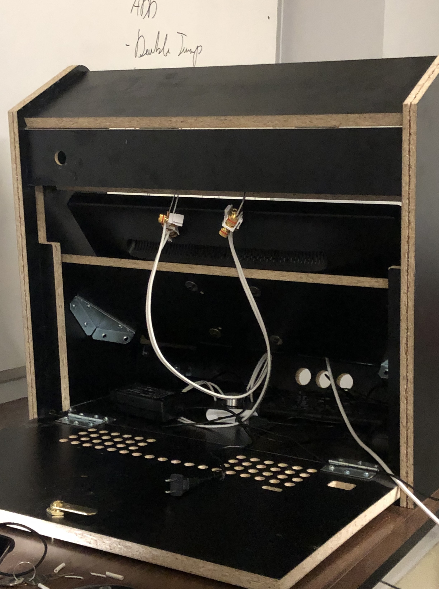

# Arcadia

Ce projet multimédia repose sur la création d'une borne d'arcade complète et d'un jeu de plateforme conçu spécifiquement pour celle-ci. Il vise à offrir aux utilisateurs une expérience de jeu interactive, tout en réintégrant l'esthétique vintage des anciennes bornes d'arcade.

## Bande Annonce
## Documentation vidéo de l'installation en action
## Gallerie photo du projet réalisé

* 
* 
* 
* 
* 
* 

